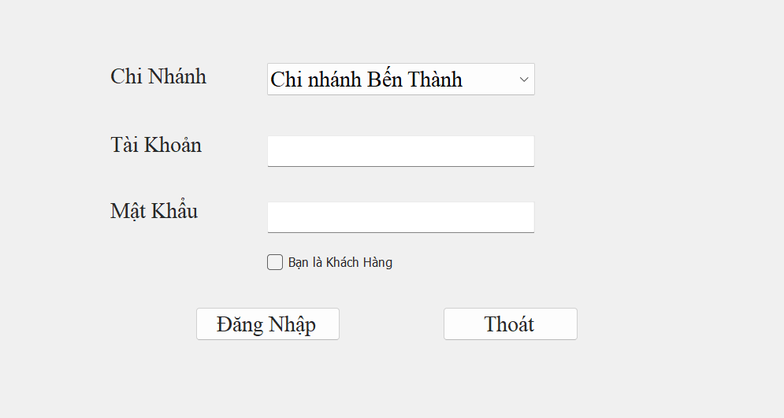
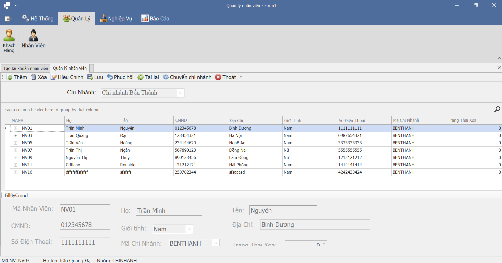
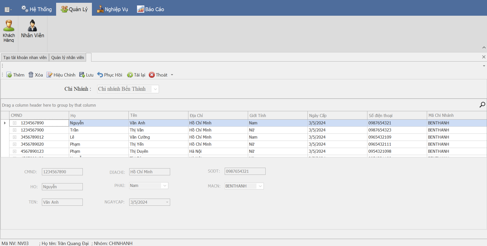
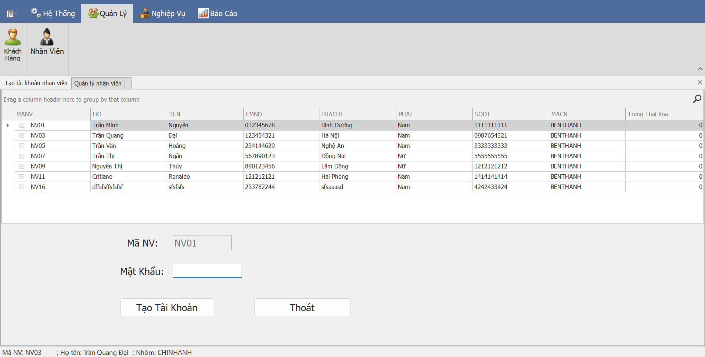
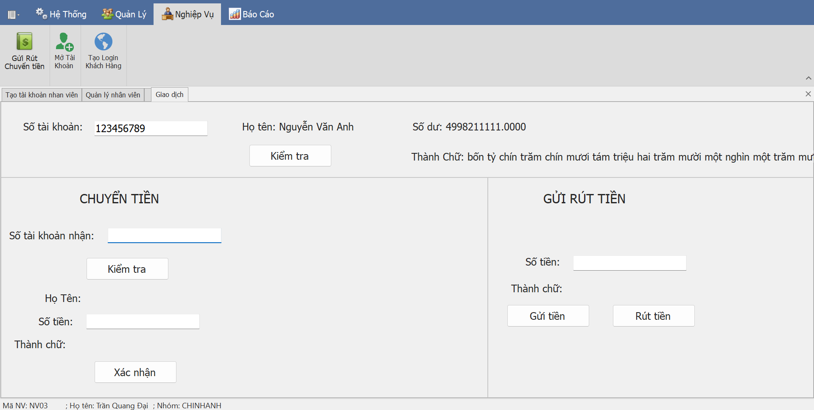
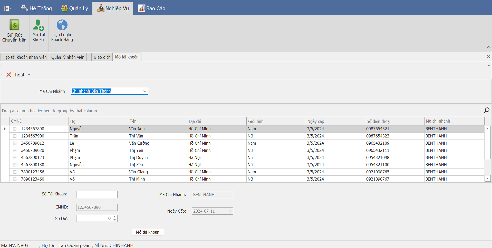

# Cơ Sở Dữ Liệu Phân Tán
## Đề tài: Ngân Hàng
Yêu cầu đê tài:
A. Cập nhật:

1.	Cập nhật Khách hàng

2.  Mở tài khoản cho khách hàng: thiết kế theo SubForm

3. Cập nhật nhân viên: thêm / xóa / ghi / Chuyển nhân viên qua chi nhánh khác

4. Cập nhật các giao dịch của khách: gởi tiền, rút tiền, chuyển tiền 

Ghi chú: 
	- Sinh viên tự thiết kế các mẫu.
	- Các form đều có đầy đủ các chức năng: Thêm,  Xóa, Phục hồi, Ghi, Thoát
           
B. Liệt kê - Thống kê
1.	Sao kê giao dịch của 1 tài khoản trong 1 khoảng thời gian (@tungay , @denngay) . Kết xuất: 
Số dư đến ngày @tungay -1: 10.000.000
Số dư đầu 	Ngay   	 Loai giao dich   	 So tien    	So du sau
10.000.000	1/3/22   		GT		          5.000.000     15.000.000
15.000.000	7/3/22			CT		          7.000.000	    8.000.000
Số dư tới ngày @denngay : 8.000.000
2.	Liệt kê các tài khoản mở trong 1 khoảng thời gian của chi nhánh, của tất cả các chi nhánh.
3.	Liệt kê các khách hàng theo từng chi nhánh, trong từng chi nhánh thì in tăng dần theo họ tên

C. Quản trị: 
Chương trình có 3 nhóm : NganHang ,  ChiNhanh, KhachHang
-  Nếu login thuộc nhóm NganHang thì login đó có thể chọn bất kỳ chi nhánh nào để xem các báo cáo bằng cách chọn tên chi nhánh,  và tìm dữ liệu trên phân mảnh tương ứng. Login nhóm này được tạo tài khoản mới cùng nhóm.  
-  Nếu login thuộc nhóm ChiNhanh thì ta chỉ cho phép toàn quyền làm việc trên chi nhánh đã đăng nhập. Login nhóm này được tạo tài khoản mới cùng nhóm.
-  Nếu login thuộc nhóm KhachHang thì ta chỉ cho phép xem Sao kê tài khoản của chính mình. Login nhóm này không được tạo tài khoản
  Chương trình cho phép tạo các login password và cho login này làm việc với quyền hạn gì. Căn cứ vào quyền này khi user login vào hệ thống, ta sẽ biết được người đó làm việc với phân tán nào hay trên tất cả các phân mảnh.

## Ưu điểm
- Tìm được được cách chuyển nhân viên nếu có nhiều hơn 2 chi nhánh
## Khuyết điểm
- Tạo login không hợp lý. Đang xử lý theo cách lấy mã nhân viên làm tên login và username. (Vì nếu nhiều ứng dụng cũng làm như thế trên server thì ứng dụng nào tạo sau sẽ không tạo được login)
- Sao kê đang bị lỗi phần hiển thị số dư
- Sao kê khách hàng thì nên hiển theo từng chi nhánh, hết chi nhánh này rồi mới đến chi nhánh khác, không nên sắp xếp chung.

`Toàn bộ sp ở trong file script.sql`
## Tools
Visual Studio 2019
DevExpress 19.2.5 
SQL Server 2022

## Tham khảo lý thuyết
[here](https://github.com/Phong-Kaster/PTIT-Co-So-Du-Lieu-Phan-Tan-Quan-Ly-Vat-Tu)
